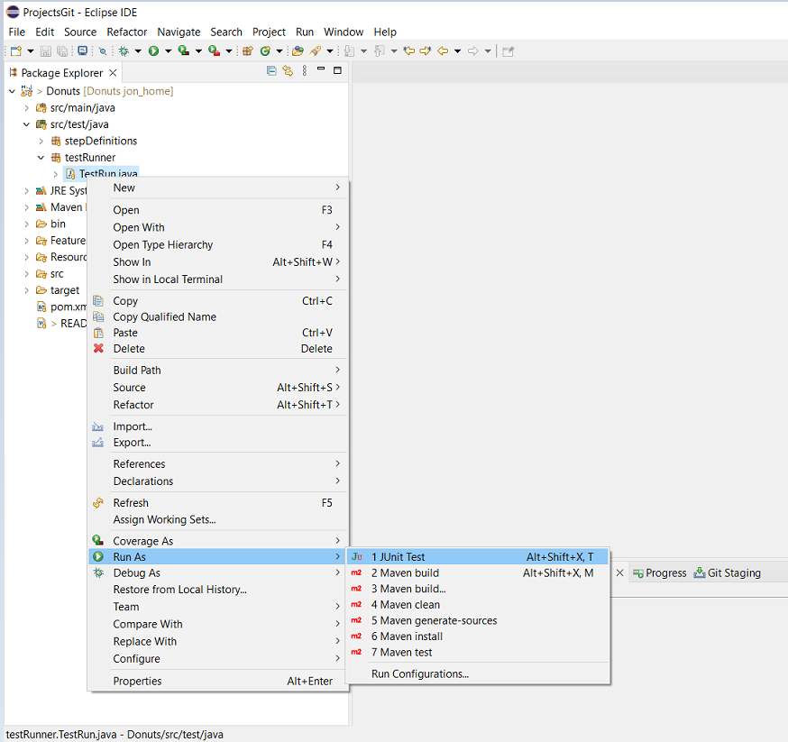

# offBeatDonuts
This is a Cucumber test framework that I've created to help anyone interested in UI Automation testing.

I chose this web site as it has some good features to practice on. Also, it is a bit temperamental when switching between pages so the tests have to be robust and able to handle behaviour that may or may not happen. All good fun.

If you don't know anything about java and selenium, by all means have a look in this repository, clone it and have a play around. If you would like some learning resources, this free course on [Udemy](https://www.udemy.com/course/automateseleniumusingjava/) is where I started.

If you'd like to know more about Cucumber and Gherkin please check this [web resource](https://jonconnorati.github.io/MyBDD_version1.github.io/) out that I created for my take on the subject. 

There's also a project I created with the same tests but using TestNG rather than Cucumber. [View it here in GitHub](https://github.com/JonConnorATI/donutsPageObjectModel)
  

## What is this repository for? ###
Practicing UI automation 

## What you will need
* Jdk 18 [Download](https://adoptium.net/en-GB/temurin/releases/?version=18)

* Maven latest version [Download](https://maven.apache.org/download.cgi) & [How to install](https://maven.apache.org/install.html)

Once installed verify your version by running the following commands in your terminal:  
    
    java --version
    mvn --version

## IDE
You will need an editor to use the Framework. There are loads out there. My personal preference is Eclipse, but I know a lot of people prefer VS Code. Try them both and see what works best for you.

* Eclipse [Download](https://www.eclipse.org/downloads/packages/release/luna/sr2/eclipse-ide-java-developers)

* VS Code [Download](https://code.visualstudio.com/download)

## How do I get set up? ###

Clone the repository, to a folder in your machine [See Instructions here if you're not familiar](https://docs.github.com/en/desktop/contributing-and-collaborating-using-github-desktop/adding-and-cloning-repositories/cloning-and-forking-repositories-from-github-desktop)
		

<ul>
	<li>For VS Code</li> 
		<ul>
			<li>From VS Code open the Folder containing the framework</li> 
			<li>From the Extensions | <a href="https://code.visualstudio.com/docs/editor/extension-marketplace" target="_blank">Help</a></li> 
				<ul>
					<li>ensure that "Extension Pack for Java" is installed. This includes 6 extensions that are needed to run the tests</li> 
					<li>Also install the extension "Cucumber for Visual Studio Code."</li> 		
				</ul>
			<li>If there are any issues run "java:Clean Java Language Server Workspace" in the Command Palette | <a href="https://code.visualstudio.com/api/ux-guidelines/command-palette" target="_blank">Help</a></li> 
		</ul>
	<li>For Eclipse</li> 
		<ul>
		<li>From the menu bar in Eclipse select File>Open Projects from File System ...>Directory>Find the folder this project is in>Select Folder>Finish</li> 
		<li>You'll need to install a plug in "Cucumber Eclipse" | <a href="https://www.eclipse.org/community/eclipse_newsletter/2017/february/article7.php" target="_blank">Help</a></li> 
		</ul>
</ul>

The POM.xls file included in the repository has all the other plug ins and dependencies required, however you may need to force the install.

<ul>
	<li>In VS Code</li> 
		<ul>
			<li>Go to View>Command Pallete>Search for "java:Clean Java Language Server Workspace" confirm you want it run.</li> 
			<li>The project will reset and at the bottom of the Explorer tab there should be a tab "Maven" Open this select Lifecycle>Clean then when that's finished, Lifecycle>Install.</li> 
		</ul>
	<li>In Eclipse</li> 
		<ul>
			<li>Go to the pom.xml file, right click it and select Maven>Update Project>tick Force update of snapshots>OK.</li> 
			<li>When that has finished right click the pom.xml file again and select Run As>Maven Clean then when that's finished Run As>Maven Install.</li> 
		</ul>		
</ul> 

## Do I need to download a WebDriver? 

No, this framework uses the plug in [WebDriverManager](https://github.com/bonigarcia/webdrivermanager)

WebDriverManager is an open-source Java library that carries out the management (i.e., download, setup, and maintenance) of the drivers required by Selenium WebDriver (e.g., chromedriver, geckodriver, msedgedriver, etc.) in a fully automated manner. 

## Project Folder Structure

I have structured the framework like this:

* `src/main/java`: This is the root directory for our source code. It contains the Base Methods (Starting the Driver, opening the browser), Common Methods (Click, wait for an element to be present) which are methods that we would constantly be calling in our code, so we put them in one place so we don't have to keep writing them every time we need them, and finally the page methods which are specific to the page you are testing.
 

* `src/main/test`: This is root directory for our test code. Keep your test related code here, Step Definitions and Test Runners.

* `src/Features`: This is where the cucumber/gherkin files are kept

## How it works

Once we've written all the Feature files, Step definitions and Page Methods we need a Test Runner. We specify in this Runner which Features to run and the folder where the steps are. dryRun is either true or false and if its true the code just runs the cucumber side of things and doesn't open the browser. Monochrome is either True of False, and it's something to do with the way the text displays in the console, if you set it to false, you get an output in the console with lots of weird characters. Plugin is to do with reports and "pretty" means they are formatted nicely!! Publish is either true or false and if it's false you don't get a report. Below is an image of the file.

 

The test runner is needed to run the tests, the way its set now it will run all the tests in the Features folder, but we can be specific and pick certain files, just alter the path

`features=".\\Features\\the folder or file we want"`

We can be more specific by using tags. If we just want the features to run that are tagged with certain text, for example @regression then set the tag in the test runner.

`tags="@regression"`

Then only features or scenarios tagged with @regression will run. If you tag a feature all the scenarios will run but if you don't want all the scenarios to run then don't tag the feature just the scenarios.

So once the runner is set up to kick off a run:

* In VS code, select the testing icon then play on the runner

 

* In Eclipse, right click the runner file then Run as JUnit test

The runner works out what scenarios to run from the features, for each `Given`, `When`, `Then` step it finds the code to run in the `stepDefinition` files this is when Java and Selenium takes over and each step definition calls the appropriate `baseMethods`, `commonMethods` and `pageMethods` from `src/main/java` 

The project is set to run 'headless' [(More Information here)](https://smartbear.com/blog/selenium-tests-headless/) which means you wont see the browser window. If you want to run it in your browser window, simply comment out the `ops.addArguments("--headless");` line in the `BaseMethods.java` file like so,

## What Next

I hope this has been helpful and you've successfully installed and ran the tests. You can now point this framework at any web site and automate tests by writing your own feature files, step definitions and page methods.

If you get stuck there's unlimited resources to tap into on the web. A big part of becoming an automation test engineer is finding out how to do things yourself. I come across automation scenarios every day where I don't know what to do to overcome an issue, so I just type `Selenium Java ....my issue...` into a google search, there's usually hundreds of others who've had the same problem.

:bulb: Top tip

If you are trying to fix something, keep your original code by commenting it out, and writing your new solution directly underneath, don't delete the original code. You might need to go back to it. The number of times I've deleted something then ended up having to write it all again .... save yourself some pain.

Good luck and happy testing !!!!!!   

    
